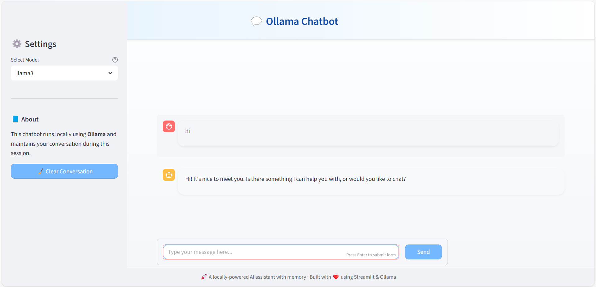

# 💬 Ollama Chatbot with Persistent Memory

 

A modern, locally-hosted chatbot interface with conversation memory, powered by Ollama and Streamlit.

## ✨ Key Features

- **Persistent Conversation Memory**: Maintains full chat history during sessions
- **Multi-Model Support**: Switch between Llama3, Mistral, Gemma, or custom models
- **Enhanced UI**:
  - Sticky header and footer for better navigation
  - Custom chat bubbles with distinct user/assistant styling
  - Smooth scrolling and responsive design
- **Local Processing**: All AI processing happens on your machine
- **Easy Configuration**: Simple sidebar controls for model selection and chat management

## 🛠️ Installation

### Prerequisites
- Python 3.8+
- Ollama installed and running ([Installation Guide](https://ollama.ai/))
- At least one LLM model downloaded (e.g., `ollama pull llama3`)

### Setup
1. Clone the repository:
   ```bash
   git clone https://github.com/yourusername/ollama-chatbot.git
   cd ollama-chatbot
   ```

2. Install Python dependencies:
   ```bash
   pip install streamlit requests
   ```

3. Start Ollama service (if not running):
   ```bash
   ollama serve
   ```

## 🚀 Usage

1. Launch the application:
   ```bash
   streamlit run app.py
   ```

2. The app will open in your browser at `http://localhost:8501`

3. Use the sidebar to:
   - Select different LLM models
   - Clear conversation history
   - View application information

4. Chat naturally in the main interface - your conversation history persists throughout the session

## 🎨 UI Customization

The application includes extensive CSS styling that you can modify:

### Key Style Elements
- **Header/Footer**: Edit the `.sticky-header` and `.sticky-footer` classes
- **Chat Bubbles**: Modify the `[data-testid="stChatMessage"]` selectors
- **Color Scheme**: Change the background and accent colors in the CSS variables
- **Sidebar**: Adjust the `.sidebar .sidebar-content` properties

To customize:
1. Edit the CSS within the `st.markdown()` call in `app.py`
2. See the comprehensive style section for all customizable elements

## ⚙️ Configuration Options

| Setting | Location | Description | Default |
|---------|----------|-------------|---------|
| Model Selection | Sidebar dropdown | Choose which LLM to use | `llama3` |
| API Endpoint | `query_ollama()` function | Ollama server URL | `http://localhost:11434` |
| Chat History | `st.session_state.history` | Conversation memory storage | Empty list |

## 📂 File Structure

```
ollama-chatbot/
├── app.py             # Main application code
├── README.md          # This documentation
├── requirements.txt   # Python dependencies
└── assets/            # (Optional) For images/screenshots
   └── screenshot.png  # Example screenshot
```

## ❓ Troubleshooting

### Common Issues

**Chatbot not responding:**
- Verify Ollama is running (`ollama serve`)
- Check if the model is downloaded (`ollama list`)
- Ensure no other service is using port 11434

**UI rendering problems:**
- Clear browser cache
- Check for Streamlit updates (`pip install --upgrade streamlit`)
- Verify all CSS classes match Streamlit's current version

**Performance issues:**
- Try smaller models if experiencing lag
- Reduce chat history length if memory constrained

## 🤝 Contributing

Contributions are welcome! Please:

1. Fork the repository
2. Create a feature branch
3. Submit a pull request

## 📜 License

MIT License - See [LICENSE](LICENSE) file for details.

---